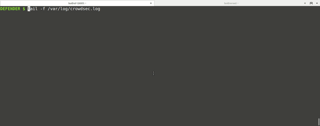
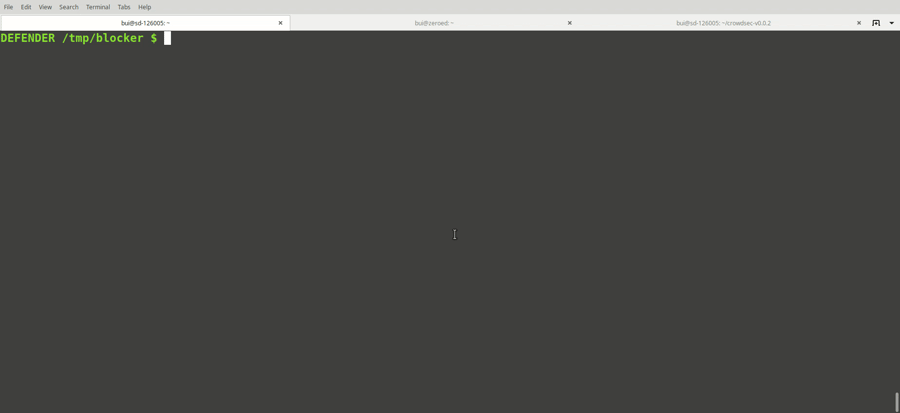
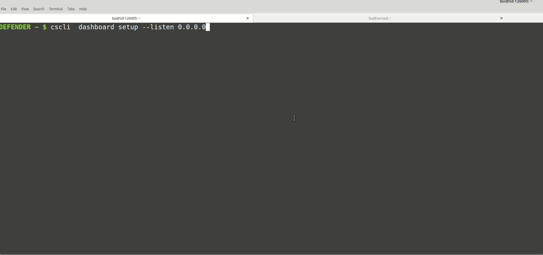

 
 
 

:books: <a href="https://doc.crowdsec.net">Documentation</a>
:diamond_shape_with_a_dot_inside: <a href="https://hub.crowdsec.net">Hub</a>
:speech_balloon: <a href="https://discourse.crowdsec.net">Discourse Forum</a>
:speech_balloon: <a href="https://gitter.im/crowdsec-project/community?utm_source=share-link&utm_medium=link&utm_campaign=share-link">Gitter Chat</a>

If you want to be notified of software **updates**, <a href="https://docs.google.com/forms/d/e/1FAIpQLSdirOC4OMYtR-HG2c54T8Ubwrq8oPLZ5k-VHOjrANip-O_KfA/viewform">click here</a>

## <TL;DR>

A modern behavior detection system, written in Go. It stacks on Fail2ban's philosophy, but uses Grok patterns & YAML grammar to analyse logs. It exposes an api, allowing to decouple detection and remediation for Cloud/Containers/VM based infrastructures. Once detected you respond to threats with various bouncers (firewall block, nginx http 403, Captchas, etc.) and blocked IPs are shared among all users to further improve their security. See [FAQ](https://doc.crowdsec.net/faq/) or read bellow for more.

## :information_source: About the CrowdSec project

Crowdsec is an open-source, lightweight software, detecting peers with aggressive behaviors to prevent them from accessing your systems. Its user friendly design and assistance offers a low technical barrier of entry and nevertheless a high security gain.

Processing is done in 5 steps:
 1. Read Data sources (log files, streams, trails, messages ...), normalize and enrich signals
 2. Matching those signals to behavior patterns, aka scenarios (*)
 3. If an unwanted behavior is detected, deal with it through a [bouncer](https://hub.crowdsec.net/browse/#bouncers) : a software component integrated into your applicative stack that supports various remediations such as block, return 403, and soon captcha, 2FA, etc.
 4. The aggressive IP, the scenario name triggered and a timestamp is sent to our curation platform (to avoid poisoning & false positives)
 5. If verified, this IP is then integrated to the block list continuously distributed to all CrowdSec users (based on the scenarios installed)

By detecting, blocking & sharing the threat they faced, all clients are reinforcing each-others (hence the name Crowd-Security). Crowdsec is designed for modern infrastructures, with its "*Detect Here, Remedy There*" approach, letting you analyse logs coming from several sources in one place and block threats at various levels (applicative, system, infrastructural) of your stack.

(*) CrowdSec ships by default with scenarios (brute force, port scan, web scan, etc.) adapted for most context, but you can easily extend it by picking more of them from the [hub](https://hub.crowdsec.net). It is also very easy to adapt an existing one or create one yourself.

## :point_right: What it is not

CrowdSec is not a SIEM, storing your logs (neither locally nor remotely).

Your data stay in your premises and are only analyzed and forgotten.

Signals sent to the curation platform are extremely limited (IP, Scenario, Timestamp), and are only there to allow the system to rule out false positives or poisoning attempts.

## :arrow_down: Install it !

Crowdsec is available for various platforms :

 - [Use our debian repositories](https://doc.crowdsec.net/Crowdsec/v1/getting_started/installation/#install-using-crowdsec-repository) or [the official debian packages](https://doc.crowdsec.net/Crowdsec/v1/getting_started/installation/#install-using-debian-official-packages)
 - An [image](https://hub.docker.com/r/crowdsecurity/crowdsec) is available for docker
 - [Prebuilt release packages](https://github.com/crowdsecurity/crowdsec/releases) are also available (suitable for `amd64`)
 - You can as well [build it from source](https://doc.crowdsec.net/Crowdsec/v1/getting_started/installation/#install-from-source)
 - FreeBSD support is [wip](https://github.com/crowdsecurity/crowdsec/issues/651)

Or look directly at [installation documentation](https://doc.crowdsec.net/Crowdsec/v1/getting_started/installation/) for other methods.

## :tada: Key points

### Fast assisted installation, no technical barrier

  
User is assisted during setup, providing functional out-of-the-box setup

  

### Out of the box detection

  
Baseline detection is effective out-of-the-box, no fine-tuning required (click to expand)

  

### Easy bouncer deployment

  
It's trivial to add bouncers to enforce decisions of crowdsec (click to expand)

  

### Easy dashboard access

  
It's easy to deploy a metabase interface to view your data simply with cscli (click to expand)

  

## 📦 About this repository

This repository contains the code for the two main components of crowdsec :
 - `crowdsec` : the daemon a-la-fail2ban that can read, parse, enrich and apply heuristis to logs. This is the component in charge of "detecting" the attacks
 - `cscli` : the cli tool mainly used to interact with crowdsec : ban/unban/view current bans, enable/disable parsers and scenarios.

