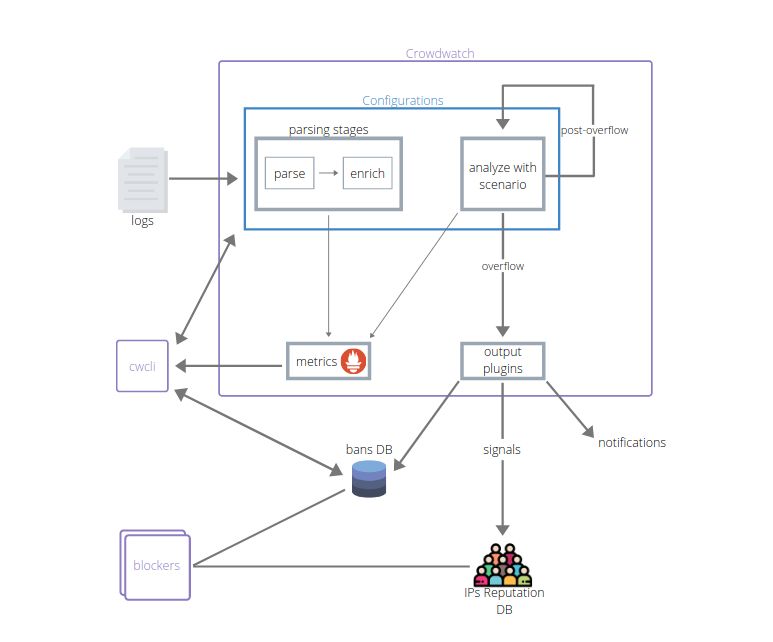

[[Hub]]({{hub.url}}) [[Releases]]({{crowdsec.download_url}})

# What is {{crowdsec.Name}} ?

[{{crowdsec.Name}}]({{crowdsec.url}}) is an open-source and lightweight software that allows you to detect peers with malevolent behaviors and block them from accessing your systems at various level (infrastructural, system, applicative).

To achieve this, {{crowdsec.Name}} reads logs from different sources (files, streams ...) to parse, normalize and enrich them before matching them to threats patterns called scenarios. 

{{crowdsec.Name}} is a modular and plug-able framework, it ships a large variety of [well known popular scenarios](https://hub.crowdsec.net/browse/#configurations); users can choose what scenarios they want to be protected from as well as easily adding new custom ones to better fit their environment.

Detected malevolent peers can then be prevented from accessing your resources by deploying [blockers]({{hub.plugins_url}}) at various levels (applicative, system, infrastructural) of your stack.

One of the advantages of Crowdsec when compared to other solutions is its crowd-sourced aspect : Meta information about detected attacks (source IP, time and triggered scenario) are sent to a central API and then shared amongst all users.

Thanks to this, besides detecting and stopping attacks in real time based on your logs, it allows you to preemptively block known bad actors from accessing your information system.

## Components

{{crowdsec.name}} ecosystem is based on the following components :

 - [{{crowdsec.Name}}]({{crowdsec.url}}) is the lightweight service that processes logs and keeps track of attacks.
 - [{{cli.name}}]({{cli.main_doc}}) is the command line interface for humans, it allows you to view, add, or remove bans as well as to install, find, or update scenarios and parsers
 - [{{blockers.name}}]({{hub.plugins_url}}) are the components that block malevolent traffic, and can be deployed anywhere in your stack

## Architecture

## Core concepts

{{crowdsec.name}} relies on {{parsers.htmlname}} to normalize and enrich logs, and {{scenarios.htmlname}} to detect attacks, often bundled together in {{collections.htmlname}} to form a coherent configuration set. For example the collection [`crowdsecurity/nginx`](https://hub.crowdsec.net/author/crowdsecurity/collections/nginx) contains all the necessary parsers and scenarios to deal with nginx logs and the common attacks that can be seen on http servers.

All of those are represented as YAML files, that can be found, shared and kept up-to-date thanks to the {{hub.htmlname}}, or [easily hand-crafted](/write_configurations/scenarios/) to address specific needs.

## Main features

{{crowdsec.Name}}, besides the core "detect and react" mechanism,  is committed to a few other key points :

 - **Easy Installation** : The provided wizard allows a [trivial deployment](/getting_started/installation/#using-the-interactive-wizard) on most standard setups
 - **Easy daily operations** : Using [cscli](/cscli/cscli_upgrade/) and the {{hub.htmlname}}, keeping your detection mechanisms up-to-date is trivial
 - **Observability** : Providing strongs insights on what is going on and what {{crowdsec.name}} is doing :
    - Humans have [access to a trivially deployable web interface](/observability/dashboard/)
    - OPs have [access to detailed prometheus metrics](/observability/prometheus/)
    - Admins have [a friendly command-line interface tool](/observability/command_line/) 

## Moving forward

To learn more about {{crowdsec.name}} and give it a try, please see :

 - [How to install {{crowdsec.name}}](/getting_started/installation/)
 - [Take a quick tour of {{crowdsec.name}} and {{cli.name}} features](/getting_started/crowdsec-tour/)
 - [Observability of {{crowdsec.name}}](/observability/overview/)
 - [Understand {{crowdsec.name}} configuration](/getting_started/concepts/)
 - [Deploy {{blockers.name}} to stop malevolent peers](/blockers/)
 - [FAQ](getting_started/FAQ/)

Don't hesitate to reach out if you're facing issues :

 - [report a bug](https://github.com/crowdsecurity/crowdsec/issues/new?assignees=&labels=bug&template=bug_report.md&title=Bug%2F)
 - [suggest an improvement](https://github.com/crowdsecurity/crowdsec/issues/new?assignees=&labels=enhancement&template=feature_request.md&title=Improvment%2F)
 - [ask for help on the forums](https://discourse.crowdsec.net)

