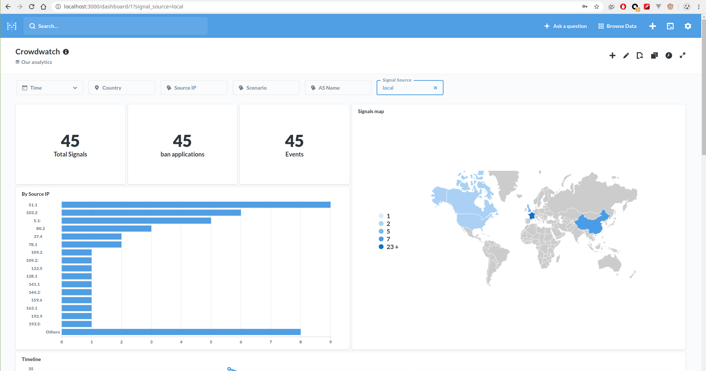

As the default database is sqlite, we use [metabase](https://www.metabase.com/) to visualize the data stored in it.

The {{cli.name}} command `{{cli.bin}} dashboard setup` will use docker to install [metabase docker image](https://hub.docker.com/r/metabase/metabase/) and fetch our metabase template to have a configured and ready dashboard. 

!!! warning "Dependencies"
    * [Docker](https://docs.docker.com/) 

Once the dashboard is setup, an URL and credentials are provided to connect to the dashboard.


!!! note
    Depending on your machine ressource, `{{cli.bin}} dashboard setup` might take a few minutes to finish.

```bash
{{cli.bin}} dashboard setup
```

```bash
INFO[0000] /var/lib/crowdsec/data/metabase.db exists, skip.  
INFO[0000] Downloaded metabase DB                       
INFO[0000] Pulling docker image metabase/metabase       
...
INFO[0001] Creating container                           
INFO[0001] Starting container                           
INFO[0002] Started metabase                             
INFO[0002] Waiting for metabase API to be up (can take up to a minute) 
...........
INFO[0034] Metabase API is up                           
INFO[0034] Successfully authenticated                   
INFO[0034] Changed password !                           
INFO[0034] Setup finished                               
INFO[0034] url : http://127.0.0.1:3000                  
INFO[0034] username: metabase@crowdsec.net              
INFO[0034] password: W1XJb8iw1A02U5nW7xxxxXXXxxXXXxXXxxXXXxxxXxXxXxXPdbvQdLlshqqPg8pf 
```

!!! tip "Protip"
    Don't forget to save your credentials !!

Now you can connect to your dashboard, sign-in with your saved credentials then click on {{crowdsec.Name}} Dashboard to get this:



Dashboard docker image can be managed by {{cli.name}} and docker cli also. Look at the {{cli.name}} help command using

```bash
{{cli.bin}} dashboard -h
```