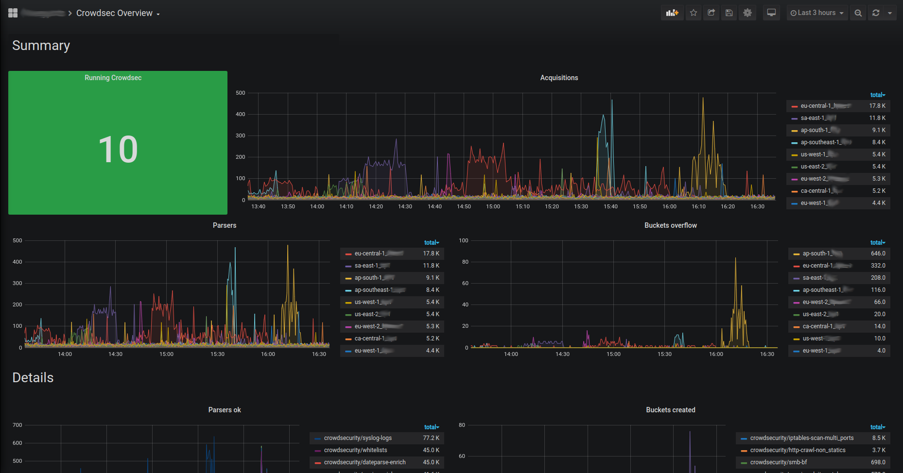
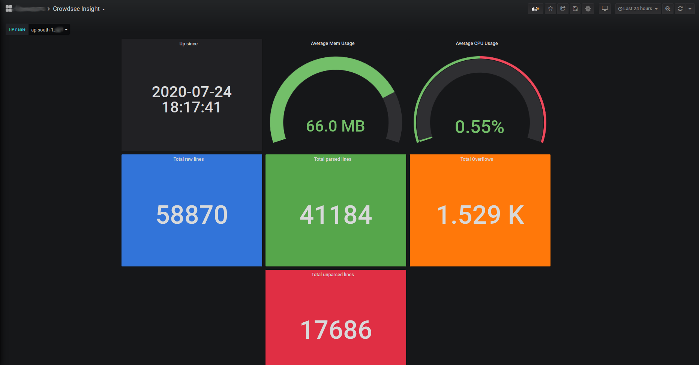
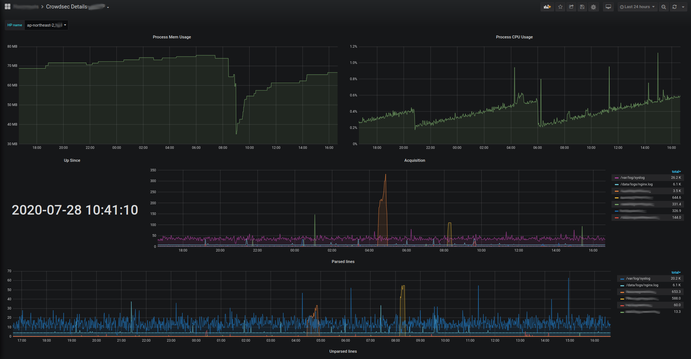

{{crowdsec.name}} can expose a {{prometheus.htmlname}} endpoint for collection (on `http://127.0.0.1:6060/metrics` by default).

The goal of this endpoint, besides the usual resources consumption monitoring, aims at offering a view of {{crowdsec.name}} "applicative" behavior :

 - is it processing a lot of logs ? is it parsing them successfully ?
 - are a lot of scenarios being triggered ?
 - are a lot of IPs banned ?
 - etc.

All the counters are "since {{crowdsec.name}} start".

### Metrics details

#### Scenarios

 - `cs_buckets` : number of scenario that currently exist
 - `cs_bucket_created_total` : total number of instantiation of each scenario 
 - `cs_bucket_overflowed_total` : total number of overflow of each scenario
 - `cs_bucket_underflowed_total` : total number of underflow of each scenario (bucket was created but expired because of lack of events)
 - `cs_bucket_poured_total` : total number of event poured to each scenario with source as complementary key 

<details>
  <summary>example</summary>


```
#2030 lines from `/var/log/nginx/access.log` were poured to `crowdsecurity/http-scan-uniques_404` scenario
cs_bucket_poured_total{name="crowdsecurity/http-scan-uniques_404",source="/var/log/nginx/access.log"} 2030
```

</details>


#### Parsers
 - `cs_node_hits_total` : how many time an event from a specific source was processed by a parser node :


<details>
  <summary>example</summary>


```
# 235 lines from `auth.log` were processed by the `crowdsecurity/dateparse-enrich` parser
cs_node_hits_total{name="crowdsecurity/dateparse-enrich",source="/var/log/auth.log"} 235
```

</details>

 - `cs_node_hits_ko_total` : how many times an event from a specific was unsuccessfully parsed by a specific parser

<details>
  <summary>example</summary>


```
# 2112 lines from `error.log` failed to be parsed by `crowdsecurity/http-logs`
cs_node_hits_ko_total{name="crowdsecurity/http-logs",source="/var/log/nginx/error.log"} 2112
```

</details>

 - `cs_node_hits_ok_total` : how many times an event from a specific source was successfully parsed by a specific parser

 - `cs_parser_hits_total` : how many times an event from a source has hit the parser
 - `cs_parser_hits_ok_total` : how many times an event from a source was successfully parsed
 - `cs_parser_hits_ko_total` : how many times an event from a source was unsuccessfully parsed


#### Acquisition

 - `cs_reader_hits_total` : how many events were read from a specific source

#### Info

 - `cs_info` : Information about {{crowdsec.name}} (software version)

### Exploitation with prometheus server & grafana

Those metrics can be scaped by [prometheus server](https://prometheus.io/docs/introduction/overview/#architecture) and visualized with [grafana](https://grafana.com/). They [can be downloaded here](https://github.com/crowdsecurity/grafana-dashboards) :





