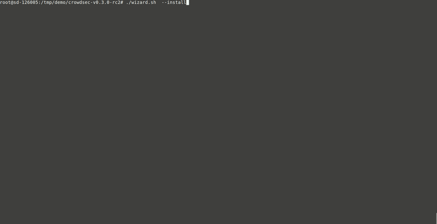

# Installation

Fetch {{v0X.crowdsec.name}}'s latest version [here]({{v0X.crowdsec.download_url}}).

```bash
tar xvzf crowdsec-release.tgz
```
```bash
cd crowdsec-v0.X.X
```

A {{v0X.wizard.name}} is provided to help you deploy {{v0X.crowdsec.name}} and {{v0X.cli.name}}.

## Using the interactive wizard

```
sudo {{v0X.wizard.bin}} -i
```



The {{v0X.wizard.name}} is going to guide you through the following steps :

 - detect services that are present on your machine
 - detect selected services logs
 - suggest collections (parsers and scenarios) to deploy
 - deploy & configure {{v0X.crowdsec.name}} in order to watch selected logs for selected scenarios
 
The process should take less than a minute, [please report if there are any issues]({{v0X.wizard.bugreport}}).

You are then ready to [take a tour](/Crowdsec/v0/getting_started/crowdsec-tour/) of your freshly deployed {{v0X.crowdsec.name}} !

## Binary installation

> you of little faith

```
sudo {{v0X.wizard.bin}} --bininstall
```

This will deploy a valid/empty {{v0X.crowdsec.name}} configuration files and binaries.
Beware, in this state, {{v0X.crowdsec.name}} won't monitor/detect anything unless configured.

```
cscli install collection crowdsecurity/linux
```


Installing at least the `crowdsecurity/linux` collection will provide you :

 - syslog parser
 - geoip enrichment
 - date parsers


You will need as well to configure your {{v0X.ref.acquis}} file to feed {{v0X.crowdsec.name}} some logs.


## From source

!!! warning "Requirements"
    
    * [Go](https://golang.org/doc/install) v1.13+
    * `git clone {{v0X.crowdsec.url}}`
    * [jq](https://stedolan.github.io/jq/download/)


Go in {{v0X.crowdsec.name}} folder and build the binaries :

```bash
cd crowdsec
```
```bash
make build
```


{{v0X.crowdsec.name}} bin will be located in `./cmd/crowdsec/crowdsec` and {{v0X.cli.name}} bin in `cmd/crowdsec-cli/{{v0X.cli.bin}}` 

Now, you can install either with [interactive wizard](#using-the-interactive-wizard) or the [unattended mode](#using-unattended-mode).