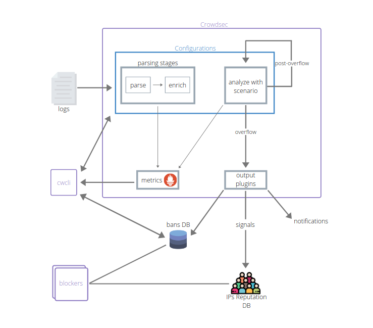

[[Hub]]({{v0X.hub.url}}) [[Releases]]({{v0X.crowdsec.download_url}})

# Architecture

## Components

{{v0X.crowdsec.name}} ecosystem is based on the following components :

 - [{{v0X.crowdsec.Name}}]({{v0X.crowdsec.url}}) is the lightweight service that processes logs and keeps track of attacks.
 - [{{v0X.cli.name}}]({{v0X.cli.main_doc}}) is the command line interface for humans, it allows you to view, add, or remove bans as well as to install, find, or update scenarios and parsers
 - [{{v0X.bouncers.name}}]({{v0X.hub.plugins_url}}) are the components that block malevolent traffic, and can be deployed anywhere in your stack

## Moving forward

To learn more about {{v0X.crowdsec.name}} and give it a try, please see :

 - [How to install {{v0X.crowdsec.name}}](/Crowdsec/v0/getting_started/installation/)
 - [Take a quick tour of {{v0X.crowdsec.name}} and {{v0X.cli.name}} features](/Crowdsec/v0/getting_started/crowdsec-tour/)
 - [Observability of {{v0X.crowdsec.name}}](/Crowdsec/v0/observability/overview/)
 - [Understand {{v0X.crowdsec.name}} configuration](/Crowdsec/v0/getting_started/concepts/)
 - [Deploy {{v0X.bouncers.name}} to stop malevolent peers](/Crowdsec/v0/bouncers/)
 - [FAQ](/faq/)

Don't hesitate to reach out if you're facing issues :

 - [report a bug](https://github.com/crowdsecurity/crowdsec/issues/new?assignees=&labels=bug&template=bug_report.md&title=Bug%2F)
 - [suggest an improvement](https://github.com/crowdsecurity/crowdsec/issues/new?assignees=&labels=enhancement&template=feature_request.md&title=Improvment%2F)
 - [ask for help on the forums](https://discourse.crowdsec.net)

