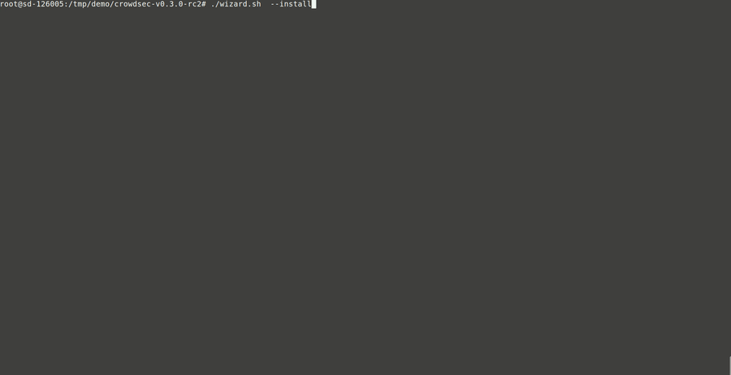

# Installation methods

You can install crowdsec in different ways :

 - Most users [set up crowdsec's repositories](/Crowdsec/v1/getting_started/installation/#install-using-crowdsec-repository) and install from them, for ease of installation and upgrade
 - Some users [use debian's official crowdsec packages](/Crowdsec/v1/getting_started/installation/#install-using-debian-official-packages)
 - Some users download the DEB package directly and [install it manually](/Crowdsec/v1/getting_started/installation/#manually-install-the-debian-package)
 - Some users download the tarball directly and [install it manually](/Crowdsec/v1/getting_started/installation/#install-from-the-release-tarball)
 - Some users use the [docker hub image](https://hub.docker.com/r/crowdsecurity/crowdsec)
 - And the most adventurous might want to [build & install from source](/Crowdsec/v1/getting_started/installation/#install-from-source)
 - And some might even want to [build their own docker image](/Crowdsec/v1/getting_started/installation/#build-docker-image)
 - Or use it with [docker-compose](https://github.com/crowdsecurity/example-docker-compose)


!!! info
    Packaging for FreeBSD and RedHat/CentOS are WIP at the time of writing. Documentation will be updated once those packages are published & functional.

# Install using crowdsec repository

Crowdsec distributes their own pragmatic debian packages that closely follow the development stream (packages are automatically published on release), and are suitable for those that want to keep up with the latest changes of crowdsec.

## setup the repository

```bash
wget -qO - https://s3-eu-west-1.amazonaws.com/crowdsec.debian.pragmatic/crowdsec.asc |sudo apt-key add - && echo "deb https://s3-eu-west-1.amazonaws.com/crowdsec.debian.pragmatic/$(lsb_release -cs) $(lsb_release -cs) main" | sudo tee /etc/apt/sources.list.d/crowdsec.list > /dev/null
sudo apt-get update
```

The following debian suites / architectures are available :

## install crowdsec

```bash
sudo apt-get install crowdsec
```

## compatibility matrix

<center>

| Suite       | Architecture     |
| :------------- | :----------: | 
|  bionic | amd64, arm64, i386   |
| bullseye   | amd64, i386 |
| buster | amd64, arm64, i386 |
| focal |  amd64, arm64, i386 | 
| sid | amd64, i386 |
| stretch | amd64, arm64, i386 | 
| xenial | amd64, arm64, i386 | 

</center>

# Manually install the debian package

Fetch your package from the [public repository](https://s3-eu-west-1.amazonaws.com/crowdsec.debian.pragmatic/), and install it manually :

```bash
sudo dpkg -i ./crowdsec_1.0.7-4_amd64.deb
```

# Install using debian official packages

Crowdsec is available for [bullseye & sid](https://packages.debian.org/search?searchon=names&keywords=crowdsec) and can be installed simply :

```bash
sudo apt-get install crowdsec
```

# Install from the release tarball

Fetch {{v1X.crowdsec.name}}'s latest version [here]({{v1X.crowdsec.download_url}}).

```bash
tar xvzf crowdsec-release.tgz
```
```bash
cd crowdsec-v1.X.X
```

A {{v1X.wizard.name}} is provided to help you deploy {{v1X.crowdsec.name}} and {{v1X.cli.name}}.

## Using the interactive wizard

```
sudo {{v1X.wizard.bin}} -i
```



The {{v1X.wizard.name}} is going to guide you through the following steps :

 - detect services that are present on your machine
 - detect selected services logs
 - suggest collections (parsers and scenarios) to deploy
 - deploy & configure {{v1X.crowdsec.name}} in order to watch selected logs for selected scenarios
 
The process should take less than a minute, [please report if there are any issues]({{v1X.wizard.bugreport}}).

You are then ready to [take a tour](/Crowdsec/v1/getting_started/crowdsec-tour/) of your freshly deployed {{v1X.crowdsec.name}} !

!!! info
        Keep in mind the {{v1X.crowdsec.name}} is only in charge of the "detection", and won't block anything on its own. You need to deploy a {{v1X.bouncers.Htmlname}} to "apply" decisions.

## Binary installation

> you of little faith

```
sudo {{v1X.wizard.bin}} --bininstall
```

This will only deploy the binaries, and some extra installation steps need to be completed for the software to be functional :

 - `sudo cscli hub update` : update the hub index
 - `sudo cscli machines add -a` : register crowdsec to the local API
 - `sudo cscli capi register` : register to the central API
 - `sudo cscli collections install crowdsecurity/linux` : install essential configs (syslog parser, geoip enrichment, date parsers)
 - configure your sources in your {{v1X.ref.acquis}} : `/etc/crowdsec/acquis.yaml`

You can now start & enable the crowdsec service :

 - `sudo systemctl start crowdsec`
 - `sudo systemctl enable crowdsec`

## Using the unattended wizard

If your setup is standard and you've walked through the default installation without issues, you can win some time in case you need to perform a new install : `sudo ./wizard.sh --unattended` 

This mode will emulate the interactive mode of the wizard where you answer **yes** to everything and stick with the default options. 

# Install from source

!!! warning "Requirements"
    
    * [Go](https://golang.org/doc/install) v1.13+
    * `git clone {{v1X.crowdsec.url}}`
    * [jq](https://stedolan.github.io/jq/download/)


Go in {{v1X.crowdsec.name}} folder and build the binaries :

```bash
cd crowdsec
make release
```

This will create you a directory (`crowdsec-vXXX/`) and an archive (`crowdsec-release.tgz`) that are release built from your local code source. 

Now, you can install either with [interactive wizard](#using-the-interactive-wizard) or the [unattended mode](#using-unattended-mode).

# Build docker image

Crowdsec provides a docker image and can simply built like this :

```bash
git clone https://github.com/crowdsecurity/crowdsec.git && cd crowdsec
docker build -t crowdsec .
```
