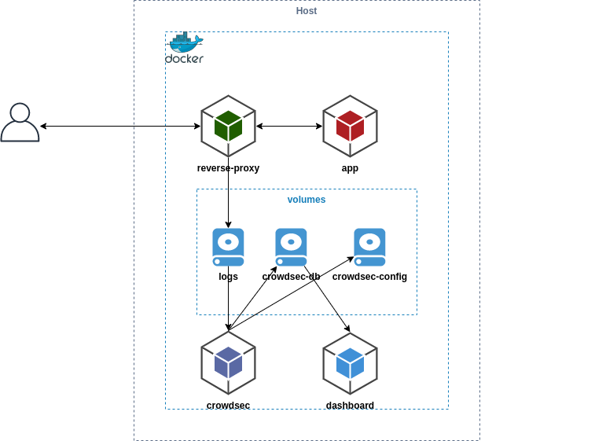

# Docker Compose

This example explains how to integrate Crowdsec in environment deployed with docker-compose. It set up multiple containers :



This example contains multiple containers :
* app : apache server serving index.html containing an `hello world`
* reverse-proxy : nginx that serving this app from the host
* crowdsec : it will read reverse-proxy logs from the shared volume
* dashboard : we use [metabase](https://hub.docker.com/r/metabase/metabase) to display crowdsec database data.

We have chosen the simplest way to collect logs (by sharing volumes between containers), if you are in production, you are probably using [logging-driver](https://docs.docker.com/config/containers/logging/configure/) to centralize logs with rsyslog or another driver, so don't forget to adapt the crowdsec docker-compose configuration to read your logs properly.

**Prerequisites:** [Docker](https://docs.docker.com/engine/install/) / [Docker Compose](https://docs.docker.com/compose/install/)

## Step 1: Run all services in docker-compose.yml

[docker compose file](docker-compose.yml) contains the yaml configuration to deploy all the containers together by on command.

Deploy the stack using : `docker-compose up -d`

Then to see the status : `docker-compose ps`

## Step 2: Install & Configure bouncer on host

Now we have crowdsec up and running, we can deploy the firewall bouncer on the host machine. It will fetch IPs to block from the crowdsec Local API deploy in docker container.

```bash
wget https://github.com/crowdsecurity/cs-firewall-bouncer/releases/download/v0.0.10/cs-firewall-bouncer.tgz
tar xvzf cs-firewall-bouncer.tgz
cd cs-firewall-bouncer-v0.0.10/
sudo ./install.sh
```

Then you need to create bouncer API key to permit the bouncer to query crowdsec Local API.

```
$ docker-compose exec crowdsec cscli bouncers add test
Api key for 'test':

   c7eb8d2789dcff96a7aa6fd0b52425ea

Please keep this key since you will not be able to retreive it!
```

Then add it to the cs-firewall-bouncer config file on the host

```
sudo vim /etc/crowdsec/cs-firewall-bouncer/cs-firewall-bouncer.yaml
```

## Step 3: Configure dashboard

The dashboard is deployed using static metabase.db ([explained here](https://docs.crowdsec.net/faq/#how-to-have-a-dashboard-without-docker)), so you have to use the defaults credentials to connect to the database, then update immediatly those credentials.

## Step 4: Simulate an attack and check detection + prevention

